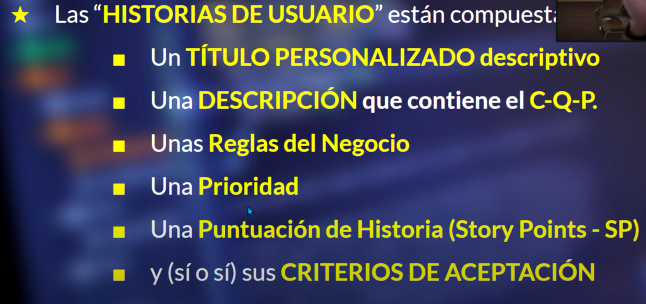

# VOCABULARY TO TAKE INTO ACCOUNT
Tipos de pruebas
Escenarios de pruebas
Metodologias 
Deuda tecnica
Herramientas más comunes para hacer pruebas
Pruebas de caja blanca y pruebas de caja negra
Entregar valor a nuestros clientes   
Las cosas saldran bien
Las cosas saldran mal
Cumplir 
Entregar  
All vs whole 
Assersionts
SetUp and TearDown
Testing Pyramid
Integrations tests
Unit tests 
Test scenario
Recruitment Manager
Tech based companies 
Software is functional
Compoused
Contain 
Implementing 
Individual task 
Deliverable software 
Budget 
Catalog 
Priority
Urgent
Important
Moderately important
Nice to have Low priority 
Low priority 
Nice to have 
Frequent chek-up 
Unclear
nerve wrecking
Rehashing 
Hash 
Land 
Get futured 
Assessment process 
Hight quality is a very generic term 
We value to things 
Communicator 
Technical expertise
Vouch 
Fail 
He has exposure 
Latter
He is a good fit for that 
Failing you 
We hit 30 minutes
I will cut us off 
We have some time for the other questions after  
Open-ended
Dauting 
Bunch of data 
Hoisting an event and some people came in 
Write a function 
Inner join with javascript  
A function that will perform 
Correlated to the field name that we want to perform the join on 
Sake 
Flat object
Nested
Prefaces
Heads down 
Take away

# AGILE METHODOLOGIES
1. Customer's inception
2. User stories
3. Iterations as part of a development process

When is it you would have to have their products ready 
To transform an itangible idea into working 

Analyzins custometer request to know excatly what they want jus to make sure you are no making any mistake

# What's the customer's inception ? 

## What ara user stoires ?  
Are individual task the software has to do, and obviously 
you have to code it. User stoires just are ideas that have to be simplify into smaller and actionable tasks.

Build the initial requirement a group of actions the software 
has to perform , you have to listen to your customers closely 

## What is an interation ? 

The repetition of a process its a periodo after which you get together wit the client and discuss your progress A milestone or checkpoint. 
- Have an interation once you have completed the user stories in the period 
- Show your customer your working code. 

Are important becuase they help you control your progress and make sure you are following your customers instructions. Developing without interations can go dwon hail very easealy. 

Customer-oriented requirements and important cocepts for interations cycles

1.
Accurate communication: Customer requirements / Understanding the customer.At the beginning some information might still be unclear - go back to the customer and clarify. Get info on requriments. Thins of everythinh you need before you start building the software

# Examples
- How many different types of bicycles does the software have to support?
- Should the software allow any changes to color or model  once the bicycles have been purchased? 
- Does the software have an administrator interface to make changes?
- Will the software have to talk to other systemns Paypal or Google maps or any other systemas are involved in the development process there ?
- Questions for the bicycle store: Is there a particular way in which you want to sort the bikes? 
- How will your customers pay? 
- Will it be a international store with shipping? 
- Do you want to have an option of choosing multiple languages? 
- Which languages would you like to have in your website? 
- Is there a specific palette of colors you would like to use? 
- Will there be spare parts for the bikes? 
- Do you want a responsive website ? 
- What kind of payment method do you prefer ?
- Would you have already your company logo?
- What kinds of bicycles do you want to sell ?
- Would you want to have the option to register and log in ?
- Would you want to have the option to add discount coupons ?
- What methods of payment do you want to have ?
- What are the categories of bicycles ?

2. **Idea branstorming:** A ssesion designed to express ideas about the project design. Any idea can be expressed. Promote the right atmosphere to avoid having a foggy or muffled session. All ideas area welcome no matter how crazy they are. I truly beilieve two heads are better than one and four heads are better than two as long as people can contribute without criticism.

3. **User stories:**  You´re priority is to satisfides your customer, thorught early and delivery of valuable software. The user stories should be writtin so that our custoemr can understand them

4. **Estimates:** By when the software is going to be ready after the inital requirement capture stage you will have clear user stories. The customer will then want to when those stories will be built. Your estimae is the sum of all the time you need to build the user stories.

How long will it take to complete the project? 

How iteration cycles work 

Goals for this lesson 
1. Iteration cycles: 
- The secret to great software is Iterations, and constant communication with your users 
- Yo cant simply ignore the customer during development 
- You get to ask the question: How am I doing? 

2. Estimating the whole project: Each iteration is a mini cycle to produce quality software with requirements design 
code ans test, each cycle produces working queality sofwatre A process is really just a sequence of steps.

3. Reaching consesus in estimations: Your itaration lenght should be at the right tempo for your project. 

User stories define the WHAT of the project 
Estimates define the WHEN. by when will we have the software ready

This is were the customer ask the big questions, how long will it take to take to deliver this software ? 

Your project estimae is the sum of estimates for your user stories 

To figure out how long it will take to complete all of the requirements captured in your user stories you need yo 
reach consensus in you estimations

Reaching consensus in estimations: 
reach than point where the software is working. 
This is all about analyze the next example: 
NEXT USER STORY: You need to enable the software to receive payments
Think about people payinh with a credit / debit card

Developers may have different estimations based on their indivedual assumptions. 

We have to sit down with your team and figure out a way to come to some sort of concensus base on their 
individual assumptions. SOme people might desagree it is important to reach an agretmeet with everybody. 

Planning considering priorities 
1. Planning considering priorities:
2. Milestones:

Previosly
However, after informing the customer she says;
Listen, I dont have that much time, i will give you 90 days....
Planning considering priorities
Go back and prioritize your stories with the client
The client is responsible for selecting the most relevant user stories its their decision is 
a very good way to ensure the will happy with the end product we are involving here in the desicion. 
Milestones
Is a major release
Your deliver your software and you expect to get paid for it 
This differs from iterations because during an iteration you show your customer the software for your feedback 
Is all about delivering software with baseline functionality
Don´t try to include fancy functions, instead focus on delivering software that will cover baseline functionality 

https://www.businessnewsdaily.com/4987-what-is-agile-scrum-methodology.html

# Issue management system 
Es la herramienta con la que se trabaja un proyecto de software que permite administrar muy bien proyectos de cualquier tipo de escala. sirven para:

- Create Features
- Creación y seguimiento de incidencias
- Gestión de codigos  
- Test management
- Gestion de tareas
- Gestion de todo tipo de reportes

Cada icono indica el tipo de incidencia 

# What is a Feature ? 
The bussnies analist or the product owner takes the clients ideas and tranforme them into user stories whether it is a feature or epic or a sub-epic- Then The UX and UI team, the development team and the QA team analyze the requirementes and start working on them in their areas. 

As testers we a have to create de **Test design** and **Test cases**. 

Espesificaciones de Reglas 
Analisis de scope
Criterios de aceptación 
Analisis Funcional "Text Exploratory"

# Jerarquia in JIRA
> INITIATIVE > EPIC > FEATURE > STORY 
> INITIATIVE 2 > EPIC > FEATURE > STORY

# Jerarquia in AzureDevOps 
> EPIC > FEATURE > STORY 

> INITIATIVE: Origen of ideas is epics father, en jira es deficil ver init porque es más como el proyecto en si

> FEATURE: Es una funcionalidad del SUT it can be either an epic or a user story

> EPIC: Es una funcionalidad completa grande o compleja como por ejemplo el header, una sección, una página completa, 

> STORY: Es una feature espesifica, un verbo usualmente es lo que se usa para describir una user story 

The login website is big Feature so it is an epic 
A button is a small feature so it is a user story not an epic.

## What is User story ? 
Check agile methodologies course

## Where the user stories come from ?
In the product backlog from the release plan and the it pass to the teams
Las hace el product owner o el nussnies analist > product backlog > sprint backlog 
desde el release plan 

## How to create user stories ? 
- Tittle it has to be descriptive
- Description of what it contains C Q P
- User the how-want-for format: As a user I want to be able to buy a product
- Feature bussiness rules 
- Priority 
- Estimation (Story Points)
- Acceptance criteria (AC)

----