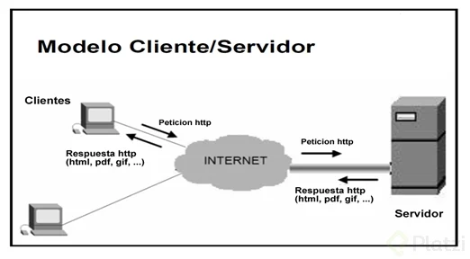
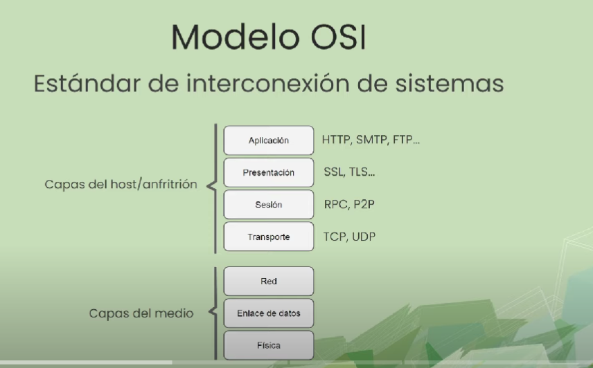
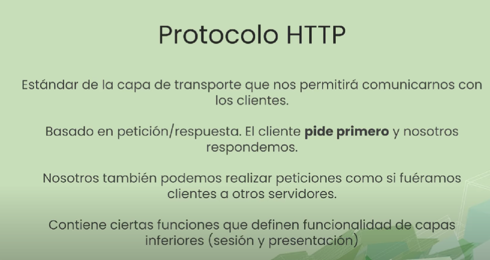
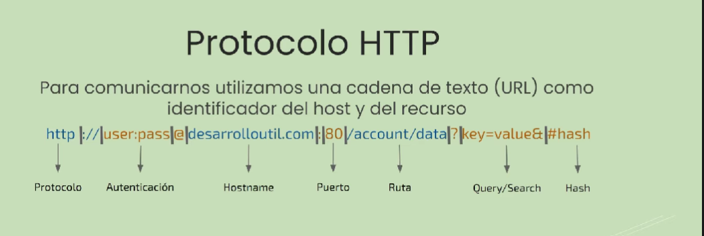
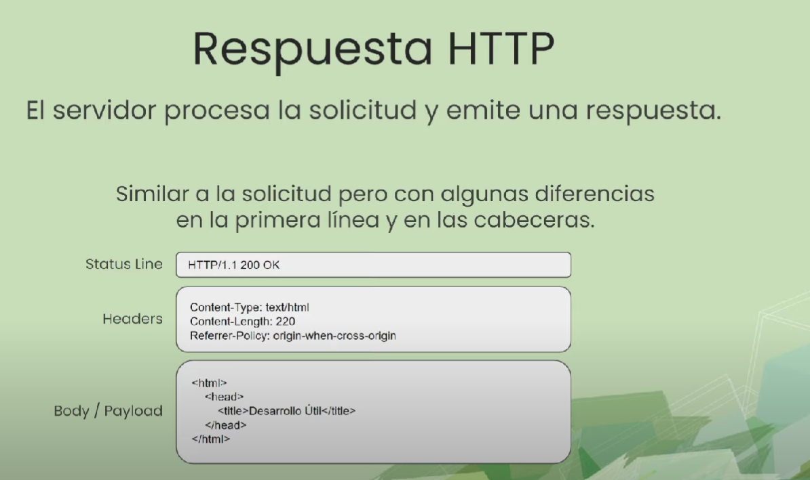
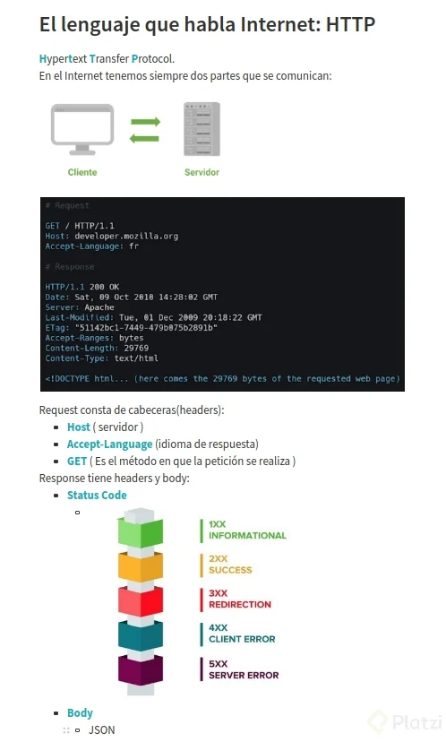
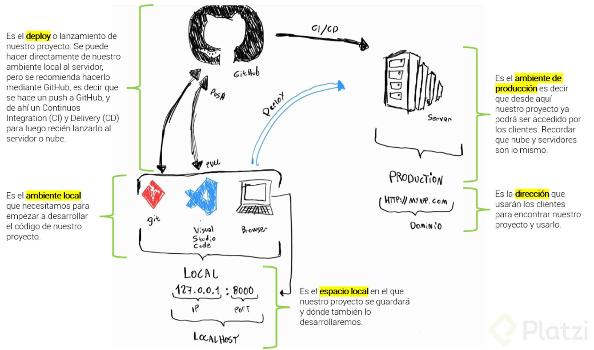

# Aplicaciones y sitios web 
Las aplicaciones o paginas que funcionan en la web son sistemas que funcionan sobre la infraestructura del internet, esto permite que diversos dispositivos distribuidos a través del mundo se puedan comunicar. Para realizar esta tarea las computadoras, tablets y telefonos asumen un rol en el **modelo cliente-servidor**.

## MODELO CLIENTE-SERVIDOR
La arquitectura cliente-servidor es un modelo de diseño de software en el que las tareas se reparten entre los proveedores de recursos o servicios, llamados **servidores**, y los demandantes, llamados **clientes**. Un cliente realiza peticiones a otra maquina, el servidor, quien le da respuesta.

## ROL DE CLIENTE: 
El cliente es un dispositivo, generalmente una computadora, un celular o tableta el cual pide o solicita recursos los cuales son necesarios para visualizar algun tipo de contenido o para realizar alguna tarea en la maquina del usuario. Cabe destacar que un cliente no solo le pide cosas al servidor, tambíen le pide a este que guarde cosas, las actualice o hasta las elimine.

## ROL DE SERVIDOR: 
La maquina con el rol de servidor suelen ser **computadoras bastante poderosas** las cuales estan en _data-centers_ estas maquinas estan a la espera de las peticiones de los clientes para asi servir (_de ahí su nombre_) información, contenido o lo que sea que el cliente necesite. Esta información esta guardada en los discos duros de estos servidores. Es importante resaltar que un servidor **también puede asumir el rol de cliente** ante otros servidores, dado que un servidor también puede solicitar recursos a otros servidores.

## ¿Pero como se comunican estos?
Entender el como se comunica un cliente con un servidor es un proceso complejo que para poder comprenderlo completamente es necesario profundizar un poco en temas de redes. Sin embargo, se pueden cubrir los conceptos básicos para trabajar en desarrollo de software. De la forma más básica para que computadoras que estan en distintas partes del mundo se puedan comunicar debe haber una especie de canal o formato sobre el cual todo funciones es decir una especie de intermediario. 

## MODELO OSI: 
Es un estándar de interconexión de sistemas que se compone de 7 capas.

La capa de transporte es la que se usa en programación ya que es en la que se encuentran los principales protocolos para comunicar los sistemas como http.

## HTTP:
**Es el protocolo mas extendido a la hora de comunicar maquinas:** Para comunicar cualquier cosa se debe establecer un lenguaje o un medio de comunicación el cual entiendan ambas cosas. El protocolo http es concretamente un estándar de la capa de aplicación que permite que haya comunicación entre servidores y clientes. 

El protocolo http contiene ciertas funciones que definen funcionalidad de capas inferiores (sesión y presentación).

## URLS: 
Las urls son el mecanismo que utiliza **http** para indicar el lugar en el cual se encuentra un recurso. Estas urls tienen una series de parámetros que necesitan los clientes para comunicarsen con los servidores en la siguiente imagen se descompone por partes como suele estar _estructurada una url_: 

## PETICIÓN o SOLICITUD: 
Las urls se transforman por debajo en peticiones que tienen una estructura mucho más detallada de que es lo que necesita hacer el cliente contra el servidor. 

## RESPUESTA:
La respuesta es lo que: valga la redundancia responde la maquina con el rol de servidor. Estas respuestas también tienen una estructura y se introduce otro componente llamado códigos de estado (_Http Status Codes_) que son códigos informativos de que es lo que paso en el servidor cuando se le hizo esa petición por parte del cliente. 

## Códigos de estado de respuesta HTTP:
1. Respuestas informativas (100–199),
2. Respuestas satisfactorias (200–299),
3. Redirecciones (300–399),
4. Errores de los clientes (400–499),
5. Errores del servidor (500–599).

## IMAGEN RESUMIDA DE HTPP:

---

## ¿Cómo es el flujo del desarrollo de una aplicación web?

