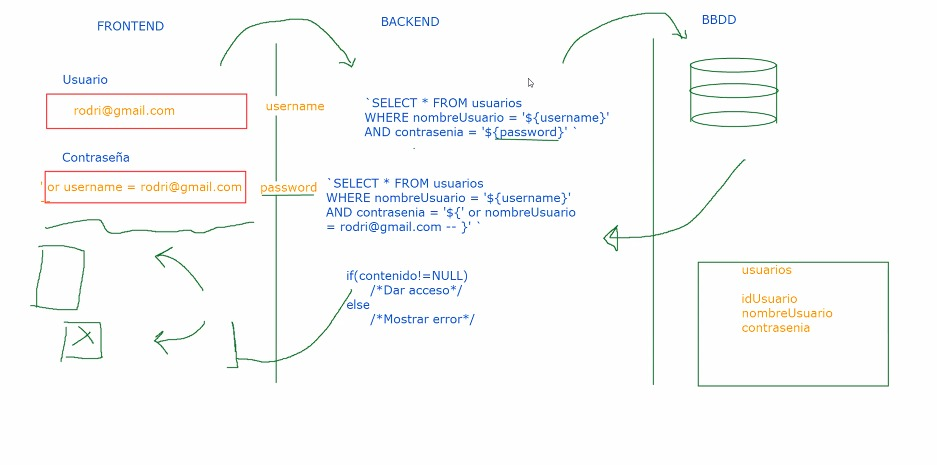
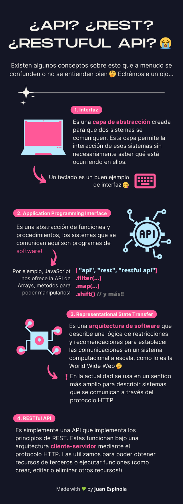
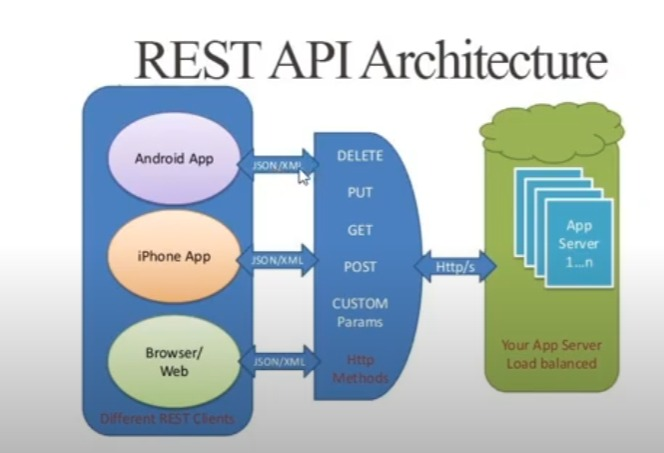
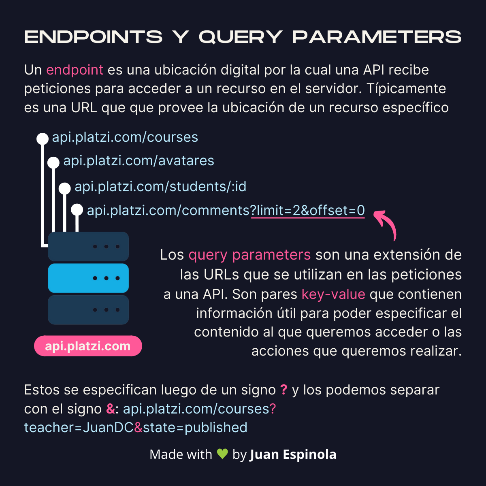
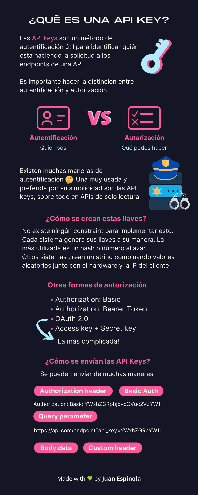

# Comunicación entre Front-end y Back-end 
La unión entre el Frontend y el Backend se hace a través de una API. 

## Tareas del front-end
El front-end tiene dos tareas principales: 

1. Comunicarse con el cliente: Rescpeto al cliente lo que le interesa al front-end es mostrarle cosas a los usuarios y además interpretar sus interraciones para comprender que quieren hacer.

2. Comunicarse con el back-end. Respecto al back-end el front-end una vez interpretado lo que hace el usuario convierte esto en solicitudes qie se mandan al backend. Es decir, el front-end lo que hace es mandarle cosas al backend o recibir cosas del mismo para mostrarselas al usuario. 

### Server-Side-Rendering: 
Es un esquema en el que se excluye a js. El navegador pide html y css al servidor (estos archivos estan guardado allí.) Haciendo que cada vez que se cambie de una pagina a otra se tenga que usar el  mecanismo de petición respuesta.

### 
Con JavaScript se puede manipular lo que hace el usuario, Javascript puede hacer peticiones  a APIS. El backend(más abajo de profundiza en sus tareas) por medio de una API-REST devuelve en _JSON_ información al front-end que luego JavaScript puede manipular

---

## Tareas del back-end
El backend tiene un rol muy importante. Este recibe las peticiones del front-end y hace cosas con estas. El back-end ademas tiene acceso a bases de datos a las cuales les pide o manda información por medio de consultas y las transforma en lógica de programación la cual se la manda a front-end para que este la transforme en información visible para el usuario.

---

# API (Application program interface)
* Una API es una sección del backend que permite que el frontend pueda comunicarse con él a través de mensajes bidireccionales (de ida y vuelta).

* Dentro del mundo de las APIS existen las nativas y externas: Las nativas son las que el entorno de ejecución traen por defecto. Las externas son softwares externos que proveen datos necesarios para hacer algo concreto en un programa.

* La mayoria de las APIS externas proveen una documentación donde mayormente se explica cual es el uso de dicha API, cuales son sus endpoints y como se le debe enviar la información a dicha API. 

## Existen dos grandes estándares para crear APIs:

## SOAP (Simple Object Access Protocol): 
Mueve la información a través de un lenguaje XML (Extensible Markup Language). Es similar al HTML, es un lenguaje de marcado. SOAP es un protocolo que ha quedado un poco en el olvido.

## REST (Representational State Transfer).

## INTRODUCCIÓN A LAS APIS REST

### ¿QUE ES REST?: 
Rest es un conjunto de reglas con las que se puede crear un estilo de arquitectura de software. Rest se basa en las reglas del protocolo http para implementar dicha arquitectura.

**APIS REST FULL:** Rest es una convención que se tiene en backend para hacer servicios web. Servicios que al final se comunican por medio del protocolo http. Htpp utiliza unos verbos que establecen lo que se va hacer con determinada información. Rest dice que se debe tener un **endpoint** por cada entidad existente y un id que es opcional.

## ENDPOINTS
En el modelo de REST un **endpoint** es una URL basicamente. Estos **Endopoints** se crean en el backend en una sección llamada routing y se consumen en el frontend, es decir front-end pide o manda información al backend por medio de estas URLS (endpoins). Un endpoint puede entenderse como un punto final o una habitación del servidor en la cual se encuentran los recursos que el cliente necesita.  

# Caracteristicas de REST:

1) **Relación cliente servidor**: A diferencia de un MVC. El cliente y servidor se mantienen debilmente acoplados. Es decir estan medio separados. Al cliente no le interesa saber lo que esta pasando en el servidor y viceversa.

2) **Las APIS REST no tienen estado**: Cada petición recibida se va manejar de manera independiente lo que evita tener secciones conectadas para hacer peticiones al mismo tiempo.

3) **Tiene que ser cacheable**: Debe haber un sistema de almacenamiento en cache para evitar repetitivas conexiones hacia un mismo recurso del servidor para mejorar el rendimiento. 

4) **Hay que mantener una interfaz uniforme**: Es decir se debe mantener una interfaz generica que permita la administración de la interacción entre cliente y servidor, en otras palabras, que para cada petición va existir una url unica y con las caracteristicas de como se le va enviar la información, esto es lo que se conoce como endpoints o puntos finales a los cuales se ouede acceder a cierto recurso. 

5) **Una API REST bien diseñada** debe de tener un sistema de capaz, esto se refiere a que del lado del servidor deben haber varias capaz a la hora de implementarla para estar previstos a si el desarrollo escala.

# EQUIVALENCIA DE UN CRUD CON UNA REST-FULL API
* SELECT - GET
* INSERT - POST
* UPDATE - PUT/PATCH
* DELETE - DELETE

* GET = Obtiene información.
* POST: Nos sirve para crear
* PUT Y PATCH: No hacer modificaciones en masa si no a una sola cosa, por eso sirve el id. La mayor diferencia entre estos dos es que con PUT se deberia enviar todos los datos y PATCH solo los datos que quiero modificar.
* DELETE: Necesita el id, es muy peligroso hacer en masa.

La mayor ventaja que existe en las REST-FULL APIS es ese leve desacople, pues el servidor solo se encarga de recibir y exponer información en formato JSON y no le interesa que haga el cliente con esta. Pues, el cliente puede ser una app movil, un fron-end o una app de escritorio. 

---

# DESCOMPONIENDO AL DETALLE UN ENDPOINT (URL)

## QUERY PARAMETERS 
Son información adicional a los endpoins para poder limitar o espesificar de una forma más detalla cual es el contenido que se le va pedir al backend. Por ejemplo si en un endpoint se dice que se quiere cargar los usuarios este va cargar **TODOS** los usuarios pero con un query param se le puede decir que de todos esos usuarios se quiere uno en espesifico, por ejemplo. 

Esto funciona si la API esta preparada para soportar estos query parameters.

### Tipos de query parameters

* ?:
* limit: Limita la cantidad de cosas a pedir
* &:
* format:

## API KEYS
Son una forma que tiene el backend para identificar y autorizar ciertas operaciones en el backend. Una de las formas de enviar estas es:
1. Usando query parameter:
2. Usando Authorization Header:

El backend tiene más formas de hacer este proceso. 

## AUTENTICACIÓN Y AUTORIZACIÓN
Son dos mecanismos que se tiene para establecer ciertas restricciones de acesso a la información por parte de los diferentes clientes..  

### AUTENTICACIÓN:
Permite identificar a cada quien.

### AUTORIZACIÓN:
Que permisos tiene cada quien.

## CORS

## ALGUNOS CONSEJOS PARA CREAR UNA API-REST 

## RESTRICCIONES PUNTUALES DE REST

1. Debe funcionar bajo el esquema cliente-servidor.

2. Debe haber una separación de responsabilidades muy clara. 

3. Interfaces estandarizas. 
   * Recursos ¿Cómo se representan entidades o conceptos? Entidades en rest significa cuales son esos recursos que va a exponer esa API
   * Representaciones. ¿En qué formato están los recursos?
   * Mensajes descriptivos. El mensaje explica su intención, es decir el verbo el status code e incluso hasta la forma que tienen las urls son muy explicativas. 

4. Rest no tiene estado:
No hay memoria de ejecuciones previas, es decir el servidor no recuerda que ha hecho antes con el cliente. Esto significa que cada solicitud debe tener todo lo necesario para ejecutarse. El servidor no deberia tener que estan guardando el cache ni autenticación. 

5. Puede ser cacheable. 
Para mejorar el rendimiento 

6. Puede existir código bajo demanda (opcional)
El servidor puede transferir código al cliente que este puede ejecutar .

7. Tiene que haber un sistema de capas. 

Debe haber una capa de api, detras de esa capa de api no se sabe que hay, puede haber un servidor o varios servidores (microservicios)
lo importante es que estas capas esconden la complejidad al cliente de contra que es lo que estos tiene que interactuar. No se puede asumir que existe una conexión directa del cliente hacia el servidor. 

## CONSEJOS PARA CREAR UNA BUENA API-REST-FULL

1. Represente recursos y no acciones. 

Los endpoints no deberian lucir así:

> GET/deleteProsduct?id=1234
> GET/postProsduct/
> POST/products/1234/delete

En cambio deberian lucir así:

>
>
> DELETE/products/1234

Para poder crear urls correctar se debe tener en cuenta como la convención de rest dfine los recursos: 

- Colecciones. Conjuntos de recursos
/products
- Documentos. Una instancia en una colección
/products/1
/products/pencil1
- Stores. Contiene recursos manejados por el cliente.
/users/20/favorites 
- Controladores. Funciones ejecutables. 
/users/20/reset-password

2. NO devolver siempre 200 OK
No siempre es correcto devolver un 200. Pues hay status code más correctos para cada tipo de situación. Rest esta pensado para que todo tenga sentido a partir de lo métodos y de los códigos de respuesta. Por lo tanto, es fundamental responder con códigos coherentes con lo que esta pasando.  

Ejemplos: 
* > 201 - Recurso creado
* > 202 - Solicitud recibida. En proceso 
* > 204 - Solicitud exitosa. Respuesta sin contenido.
* > 401 - El cliente no esta autorizado
* > 204 -  Acceso prohibido. Usuario accediendo a un recurso que no puede. 
* > 404 - Recurso no encontrado
* > 405 - Método no permitido 
* > 505 - Error interno del servidor

3. Utilizar los métodos HTTP para indicar que intención se tiene con el recurso. Es decir usar los verbos correctamente, por ejemplo si se va a eliminar seria super mal usar post. 

4. Asegurar la API
No se pueden dejar abiertos. Hay que manejar correctamente la autenticación y la autorización.

5. Versionar la API 
ejemplo: https://www.juandavidapi.con/aplicacion/v2/fotos

6. Usar JSON correctamente: 

La api debe devolver un formato estándar, como se puede usar xml, json o texto plano. Si se decanta por alguno lo ideal es que sea solo ese y no empezar a mezclar formatos, además retornar el formato correctamente según sus reglas. 

**NOTA**: No existe un estándar oficial de REST se pueden seguir o no. 

La existencia de endpoints usualmente es proporcional a la cantidad de entidades que quieres modelar en tu backend o en tu API. Digamos que por cada entidad debiera existir al menos un endpoint, y por cada uno de ellos, podrías realizar las acciones de crear, leer, actualizar y borrar datos. Y luego, si consideras que cada relación entre dos entidades da lugar a otro endpoint, puede que tengas muchos más. De nuevo, dado el modelo User, si cada usuario tiene N galerías, el endpoint

>Una buena practica es que los endpoints sean en plural.

## QUERY Params
## PATH Parameter
convenciones de rest
Los endpoints deberian ir en prural
Los endpoints no puede recibir parametros iguales, por ejemplo no puede recibir dos parametros id, deberia ser id y id_otracosa
Los endpoinst que son espesificos van antes de los que tienen parametros dinamicos
