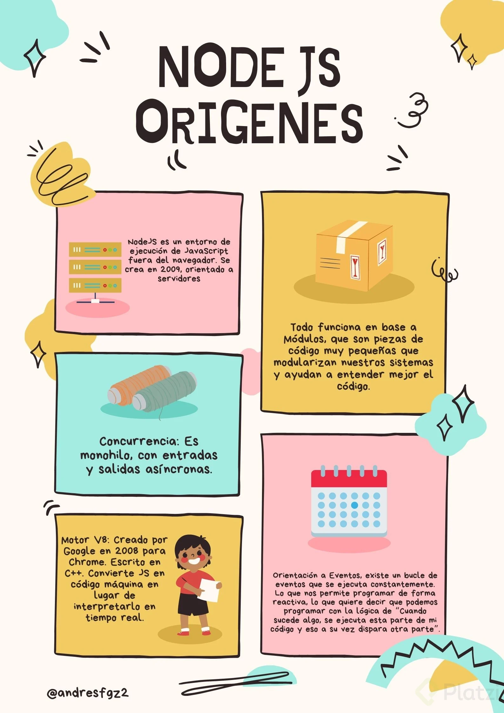

# DOCUMENTACIÓN DE NODE JS

Node JS es un entorno de ejecución de JavaScript fuera del navegador. Se crea en 2009 y es orientado a servidores. Es muy importante que esté fuera del navegador debido a que ya no es necesario un navegador web para ejecutar código JavaScript.

## Características principales de Node JS:

>Event Queue: Contiene todos los eventos que se generan por nuestro código (Funciones, peticiones, etc.), estos eventos quedan en una cola que van pasando uno a uno al Event Loop.

>Event Loop: Se encarga de resolver los eventos ultra rápidos que llegan desde el Event Queue. En caso de no poder resolverse rápido, enviá el evento al Thread Pool.

>Thread Pool: Se encarga de gestionar los eventos de forma asíncrona. Una vez terminado lo devuelve al Event Loop. El Event Loop vera si lo pasa a Event Queue o no.

>IMPORTANTE: Cuando ocurre un error dentro de alguno de los hilos y no se controla apropiadamente. Node detiene todos los hilos ejecución. Esto puede ser muy peligroso, debido a que es dificil determinar fue el origen del problema y en que punto de ejecución se encontraba cada hilo cuando fue detenido.

# Blocking code Vs No blocking code

**Bloqueante:** Cada tarea se ejecuta una detras de la otra bloqueando el hilo de ejecución de tal manera que una tarea no puede ejecutarse y tiene que esperar hasta que la tarea que esta en curso se termine.

**No bloqueante:** Un código no bloqueante es donde el hilo de ejecución del procesador no se bloquea. Es decir, las tareas no tienen que esperar a que otras terminen para ejecutarse, si no que se van ejecutando de forma simultanea. 

La programación en **Node JS** al ser asincrona es más rapida que en otros lenguajes como php, python y ruby.

### VENTAJAS DE NODE JS
* Es concurrente sin paralelismo.
* Es asíncrono y no bloqueante
* Es orientado a eventos
* Single thread basado en callbacks 

---

## EL CORE DE NODE.JS
**Node JS** tiene un nucleo el cual se compone de un conjunto de librerias y modulos que hacen funcionar a node.js de una forma más sencilla para el programador. Es decir, provee de forma nativa una serie de librerias para hacer cosas como levantar un servidor web, acceder al sistema operativo y manipular cosas de bajo nivel.

## Algunos módulos muy usados en node.js son:
- Globals
- Events
- File System
- Process
- HTTP
- Buffer
- Stream
- Timers

## Buenas practicas para trabajar en JS
### Organización del código en JS:

1. Importar librerias/modulos
2. Constantes
3. Objetos/variables
4. Funciones
5. Eventos
6. Ejecuciones

### Usar el camelCase:
- UPPERCASE
- UpperCamelCase
- lowerCamelCase
- lowercase
- snake_case
- comillas simples para strings

usar el modo estricto para trabajar con buenas practicas: 'use strict' 

---
## MODULOS EN NODE JS
Node funciona a base de módulos, estos módulos son el código  JavaScript que permite a Node tener funcionalidades "pre-hechas" para el programador.

## MODULOS DEL CORE
Son modulos que son como el corazón de Node JS. Estos módulos los podemos usar sin necesidad de importarlos explícitamente en nuestro código, pueden ser usados en cualquier archivo de Node.
Para que Node funcione correctamente siempre ha de tener sus módulos globales, son aquellos módulos que nos permiten usar la mayoría de funcionalidades básicas y complejas que conocemos de Node, como setTimeout, setInterval, console.log... etc.

### Objeto global 
En Node JS existe el **objeto global** que tiene métodos y propiedades, es como el _objeto window del navegador_ pero en **Node JS** a esto es lo que se le llama módulos globales.

Algunos módulos globales son:
* setInterval
* setImmediate
* require
* __dirname
* __filename

### Variables globales
En node, las variables globales son aquellas que son nativas del lenguaje, es decir que pertenecen a su core y no necesitan de una herramienta de terceros para poder utilizarlas (como npm), en teoría son objetos globales como en javascript son los arrays, Number, String y Functions.

### Variables de entorno
Las variables de entorno son las variables que vienen desde fuera del sistema y se pueden referenciar con “process.env.VARIABLE”, estas deben ir con MAYÚSCULAS.

NOTA: Consultar mas sobre las variables de entorno
https://jairofernandez.medium.com/manejo-de-variables-de-entorno-en-node-js-ac90f7a2c1e5

---

# SISTEMA DE MODULOS EN NODE JS: 
Normalmente cuando se crea una app se establece una pequeña arquitectura. Todo no se hace en un solo archivo si no que se crean varios y estos se van interconectando. 

## ¿Qué es un módulo?
Los modulos no son mas que un conjunto de utilidades que nos permite comunicar diferentes partes del código. Habitualmente, cada parte de ese código se encuentra en archivos y carpetas separados y son utiles para: 

* Encapsular funcionalidad 
* Incrementar la reusabilidad.
* Mejoraremos la estructura de los proyectos.

## Sistemas de módulos de NODE
Para esto se usa un sistema de modulos y Node JS por defecto trae a **Common JS** pero esta la versión más moderna que son los modulos de **ECMAS-5**.

## ¿Cual es la diferencia etre Require e Import (Common JS vs ES Modulos)

**CommonJS:** Sistema por defecto usado en Node.js. Puede exportar e importar, modulos de node js, código creado por nosotros y también Jsons.

## OBJETO Module
Es un objeto interno que tiene Node. Este objeto dentro de sus propiedades tiene una propiedad llamada **exports**. Esta propiedad también es un objeto y contiene aquello que se va a exportar. Es importante por que dice que se esta exportando realmente.

## ECMAScript Modules(ESM): 
Sistema oficial de JavaScript para la gestión de módulos.

## Como escoger el sistema de módulos que queremos usar.

### Indicandolo en el package Jsons
Si no se marca nada se esta utilizando common js dado que es por Defecto. O indicando con type:module. 

### Indicandoselo en la extensíon del archivo
* Si se pone la extensión **cjs** se usa commmon 
* Si se pone la extensión **mjs** se usa modules 
>Esto puede servir en casos en los que por ejemplo se tenga todo el sistema en modules pero por alguna razón en un archivo se quiere usar common js pues usando la extensión del archivo se fuerza a que utilice ese sistema de módulos que se le esta indicando. 

---

# Gestión de paquetes o modulos de Node js 
Es posible usar modulos de npm para gestionarlos podemos ir npm y buscar librerias se puede analizar que dependencias tienen estas librerias y otra información adicional de como funciona el paquete.

Esto se hace para no reinventar la rueda ademas incluso en cosas muy snecillas no se tiene en cuenta casos de usos y expeciones que puede romper el código, y es algo que ya estos paquetes han tenido muy en cuenta, sin embargo hay que tener cuidado al usarlos, tratar de no añadir mas de lo necesario y siempre chequear que estos esten actualizados.

---

# MODULO BUFFERS AND STREAMS

# MODULO FIYLESYSTEM

# MODULO PROCESS

# MODULO OS 

---
# MODULO HTTP EN NODE JS 
El modulo http es una libreria interna de Nodejs la cual permite crear un servidor y poder realizar conexiones con el mismo.

## Petición http
* Las URL se transforman en solicitudes que se le enviaran al servidor. Se devide en 3 partes principales.
* Status line (el verbo): El verbo indica que acción se va hacer en el servidor.
* Cabeceras: Contienen información de la petición.
* Body: Sirve para enviar contenido.

## Respuesta http: 
Es lo que el servidor responde a la petición. El servidor responde con códigos de respuestas que indican al cliente que paso con su petición. También tienen headers y bodies. Hay que tener en cuenta que el servidor por obligación debe responder, si no el cliente se queda esperando. 

Node dispone de varias librerias que permiten crear un servidor e implementar el protocolo http.

Función create server es una función que nos permite crear una representación de un servidor que va a escuchar y responder peticiones http.

## LA LOGICA ES LA SIGUIENTE: 
Para poder tener un Backe-end se debe pensar en que este rol tiene como tarea servir información. Para esto es indispensable saber que es lo que el cliente quiere que yo le **"sirva"** para poderle servir al cliente se necesita información de este. Por eso basandonos en http para poder tratar las peticiones de los clientes se necesitan 4 cosas escenciales. 

1. **El verbo o método http:** Este nos va servir para indicar que quiere hacer el cliente ¿acaso quiere que le entregue información? o ¿quizas quiere enviar información? o probablemente puede querer actualizar informacón existente o hasta eliminarla. 
2. **El Path:** Esta es necesaria para identificar donde esta eso que el cliente necesita que se le enviee o quizas donde esta ese lugar en el cual debemos guardar lo que el cliente esta mandando. 
3. **Los headers**: Información 
4. **Body**: Este principalmente para que el cliente mande información. 

## OBJETO REQUEST 
Es un objeto de js que nos permite acceder a propiedades y métodos de las solicitudes. Las solicitudes que vienen por parte del cliente se deben manipular, es decir se deben controlar en el servidor web. Esto se hace con los datos que da el cliente, esta información permite decidir que hacer en servidor en diversos contextos (REST) y que responder ante estas solicitudes. Dicha información puede ser una url headers y bodys. El objeto request nos permite acceder a este tipo de información. 

* CreateServer recibe por parámetros el requestListener el cual es un manejador del evento request.
* El metodo listen lo que hace es poner en escucha al servidor es decir, arrancarlo, ademas hay que pasarle un puerto que no este ocupado.
* En un puerto solo se puede usar una app.

## OBJETO RESPONSE

### ¿Porque utilizar librerias para manejar un servidor web?
Comprendiendo la complejidad que tiene manejar la libreria nativa de node, se entiende el porque se usan librerias de un tercero. 

Basicamente para poder responder debe establecerse un servidor, ponerlo a escuchar en un puerto y manipular el objeto response. Se debe modularizar el código y establecer que va hacer el servidor por cada tipo de verbo y en cada ruta.

* Se necesita el verbo/ Para indicar que quiere hacer el cliente.
* Se necesita el path/ Para indentificar el recurso.
* Se necesitan las cabeceras
console.log(req.headers);
* Se necesita el body en los casos que se necesite contenido. El body no lo trae por defecto por lo cual es un poco complejo porque tenemos que de alguna forma crearlo nosotros. Lo que node da es un stream de datos. Se deben ir de alguna forma acumulando la información que viene en ese stream hasta formar un body. 

