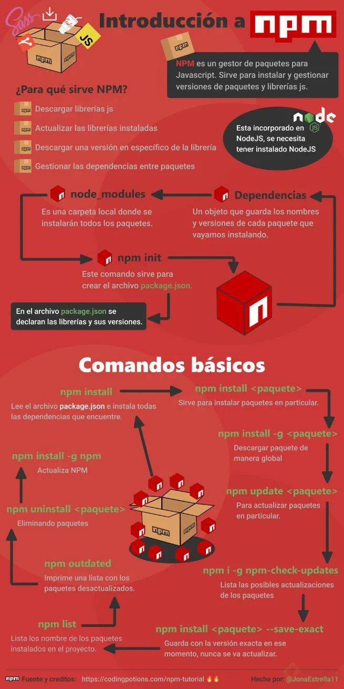
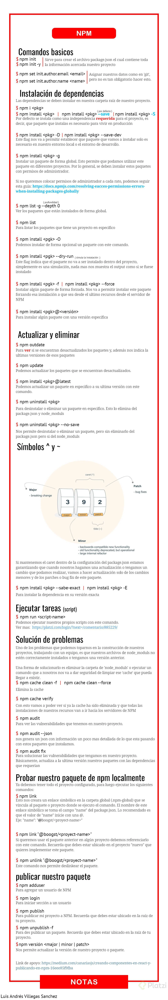

# ¿Qué es un gestor de paquetes?

En muchos artículos se habla de las grandes cualidades de los gestores de paquetes, de cómo pueden actualizar su sistema con un clic; Instalar software sin descargar manualmente, y sin dolor eliminarlos. Comprender cómo funcionan es una pequeña e interesante pieza de un rompecabezas lleno de magia. 

Los gestores de paquetes también se pueden entender como una colección de herramientas, que sirven para automatizar el proceso de instalación, actualización, configuración y eliminación de **paquetes de software**. 

Permiten integrar código de terceros en tus propios proyectos, no solo se encargan de instalar una librería, si no también, configurar tu aplicación añaden archivos extra de configuración o algo que se deba hacer para conectar el proyecto con las librerías. 

## Paquetes de software 
El primer concepto con el que nos encontramos es el de paquete. Por lo general, un paquete está compuesto de varias cosas, en su mayoría encontrará binarios, código fuente y documentación. 

> **El concepto en sí es muy simple**: Un único archivo que contiene el software. Pero no son sólo los paquetes como tal, también pueden contener instrucciones adicionales para instalar los archivos en el sistema, o para eliminarlos, o hacer copias de seguridad de ellos en la actualización. Esencialmente paquete es un software. 

----
# Dependencias
No todos los softwares son independientes (que pueden funcionar por sí solos sin instalar otro software / librerias), Usualmente en el mundo del software cuando se crea un proyecto se usan códigos que proporcionan terceros como: librerias entre otras cosas y a estas cosas se le llaman **Dependencias**

En Windows es un ejemplo notable .NET: Muchas aplicaciones se basan en esta biblioteca, sin ella no se pueden ejecutar muchos proyectos. 

En Linux este concepto es un poco más complicado … Muchos paquetes dependen de otros paquetes para funcionar, y por lo general requieren más de un paquete. Sin esas dependencias esos paquetes incluso pueden negarse a instalar. Lo peor de todo, es un paquete requiere el paquete que está tratando de instalar, podría tener más paquetes necesarios y así sucesivamente, creando una larga cadena de dependencia. 

**Esto se conoce como el infierno de dependencia**. Esta situación no era soportable por cualquier persona, por lo cual Gestor de paquetes de sistemas se inventó para resolver el problema. 

El gestor de paquete instalara la herramienta principal y todas sus dependencias, por lo tanto, el desarrollador no tiene que saber que paquetes dependen de otros paquetes para poder funcionar, si no que el gestor analiza un paquete y sabe cuales son todas sus dependencias y por lo tanto también las va a instalar para que pueda haber un correcto funcionamiento.  

La comprensión de la gestión paquete es fundamental para un administrador de sistemas y un desarollador, hay muchos gestores de paquetes y los comandos difieren un poco para cada uno. Aunque, las instrucciones básicas son siempre similares.

---

## Gestores de paquetes: Conclusiones y resumen
### ¿Qué son?
En primer lugar, se debe definir que son los paquetes: Un paquete es un conjunto de ficheros que se agrupan y que puede instalar y eliminar como conjunto. 

- Los paquetes son un conjunto de archivos o software que sirve como herramienta adicional o librería en un proyecto.
- Los gestores de paquetes son una herramienta que permiten mantener esas librerías actualizadas, instalarlas, eliminarlas, entre otras cosas. A través de simples comandos.
- Algunos paquetes requieren de otros paquetes para funcionar lo cual se conoce como dependencia.
- Los comandos varían de acuerdo al sistema gestor de paquetes que se esté utilizando.
- Los gestores de paquetes resuelven las dependencias, es decir, saben que paquetes requieren otros para funcionar y por lo tanto también los instalan y los gestionan.
- Agrupan paquetes según su función. 

---
# NPM
NPM es el gestor de paquetes para JavaScript. Con NPM se puede encontrar, compartir y reutilizar paquetes creados por otros desarrolladores para de esa forma facilitar cierta parte del proceso de desarrollo. 

Con se puede instalar, compartir y distribuir código, gestionar dependencias en proyectos, así como recibir comentarios de otras personas.

Las dependencias pueden ser actualizadas y optimizadas desde el terminal. Además, se pueden crear proyectos con archivos de dependencias y versiones que son directamente cargadas desde el archivo package.json file que es creado en cada proyecto.

## ¿Cómo funciona el Node Package Manager?
Esta herramienta funciona de dos formas:

Como un repositorio ampliamente utilizado para la publicación de proyectos Node.js de código abierto. Lo que significa que es una plataforma en línea donde cualquiera puede publicar y compartir herramientas escritas en JavaScript.

Como una herramienta de línea de comandos que ayuda a interactuar con plataformas en línea, como navegadores y servidores. Esto ayuda a instalar y desinstalar paquetes, gestionar versiones y gestionar las dependencias necesarias para ejecutar un proyecto.
Para usarlo se debe instalar node.js, ya que están desarrollados de forma agrupada. 

## DEPENDENCIAS DE PRODUCCIÓN, DEPENDENCIAS DE DESAROLLLO Y  DEPENDENCIAS OPCIONALES.

> Dependencias de producción: Son aquellos paquetes que son necesarios para que la aplicación funcione en un ambiente productivo.

> Dependencias de desarrollo: Son paquetes que se usan solo en un entorno de desarrollo con el fin de automatizar ciertas tareas, ayudar con ciertos procesos de código entre otras cosas. 

>**la diferencia de estas radica** en que las dependencias de desarrollo no tienen que ir a producción, pues estas solo apoyan el proceso de desarrollo más no son necesarias para que el proyecto funcione como tal. 

## PACKAGE JSON 
El package json es un archivo de configuración que contiene información del proyecto, como autores, liencia, pero lo más escencial que se encuentra en el package json es la información relativa a que paquetes se estan usando y cuales son de producción y cuales de desarrollo. Además se pueden crear ciertas tareas automatizadas. 

---
## SCRIPS DE NPM 
Los scripts son tareas que se automatizan por medio de comandos que se corren en la terminal. **NPM proporciona un sistema denomidado scripts** es estos scripts se encuentran en forma de una especia de colección en el P.JSON y se ejecutan desde la terminal de comandos. 

### Las tareas más frecuentes suelen ser: 

* start: Se suele usar para tareas de inicio del proyecto y se pone el archivo que va a arrancar
* dev: Se suele usar para levantar servidores de desarrollo locales. 
* serve
* build: Tarea que construye los ficheros finales para subir a la web de producción.
* test: Suele iniciar una batería de tests. 
* deploy: Suele desplegar en la web de producción la webapp construída con build.

### Correr los scrips
Estos corren con la instrucción **npm run "nombre de la abreviación"** Para ver una lista de lso scripts que se tienen se puede usar **npm run** Una forma de escoger la tarea de forma más interactica es con **npx ntl**

### Para crear scripts que se ejecuten antes o despues de algo y para conocer como organizar los scrips visitar: https://lenguajejs.com/npm/administracion/scripts-de-npm/

---

# COMANDOS DE NPM 

---

### En NPM se pueden encontrar diferentes errores. 
Sería recomendable primero intentar solucionar con npm audit fix y lo que no se solucione lo actualizamos de a uno?
Podemos revisar las vulnerabilidades de nuestro proyecto con:
npm audit
En caso de tener vulverabilidades, se recomienda usar el comando:
npm audit fix
Y en caso de que esto no lo solucione, podemos ir actualizandolos de uno en uno.

