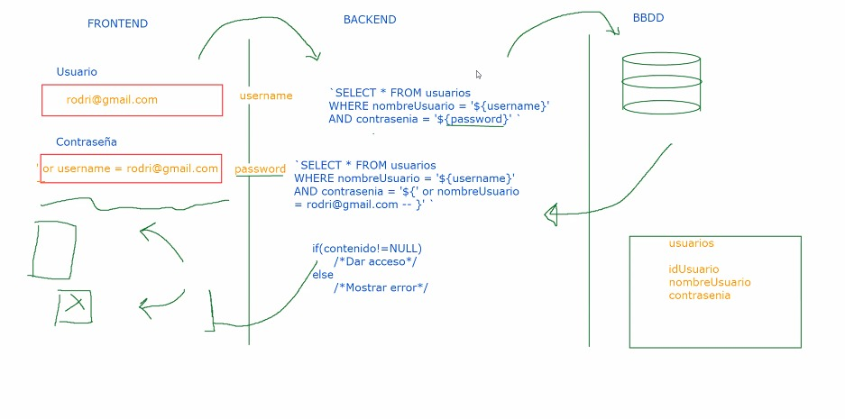
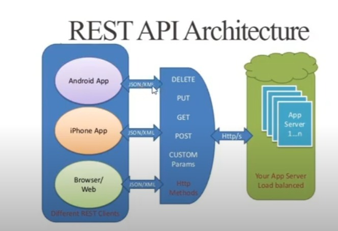

# Comunicación entre Front-end y Back-end 
La unión entre el Frontend y el Backend se hace a través de una API. 

## Tareas del front-end
El front-end tiene dos tareas principales: Comunicarse con el cliente y con el back-end. Con cliente lo que le interesa al front-end es mostrarle cosas a los usuarios y además interpretar las interraciones de los usuarios. **Respecto a su relación con el backend.** el front-end al interpretar lo que hace el usuario convierte esto en solicitudes al backend. Es decir, el front lo que hace es mandarle cosas al backend o recibir cosas del mismo para mostrarselas al usuario. 

## Server-side-rendering: 
Es un esquema en el que se excluye a js. El navegador pide html y css al servidor (estos archivos estan guardado allí.) Haciendo que cada vez que se cambie de una pagina a otra se tenga que usar el  mecanismo de petición respuesta.

## 
Con JavaScript se puede manipular lo que hace el usuario, Javascript puede hacer peticiones  a APIS. El backend(más abajo de profundiza en sus tareas) por medio de una API-REST devuelve en _JSON_ información al front-end que luego JavaScript puede manipular

## Tareas del back-end
El backend tiene un rol muy importante. Este recibe las peticiones del front-end y hacer cosas con estas. El back-end ademas tiene acceso a las bases de datos a las cuales les pide información por medio de consultas y las transforma en lógica y se la manda a front-end nuevamente en _json_.

# API (Application program interface)
Una API es una sección del backend que permite que el frontend pueda comunicarse con él a través de mensajes bidireccionales (de ida y vuelta).

Dentro del mundo de las APIS se tienen las nativas y externas: Las nativas son las que el entorno de ejecución traen por defecto. Las externas con softwares externos que nos proveen datos que vamos a necesitar para hacer algo concreto en nuestro programa.

La mayoria de las APIS externas proveen una documentación donde mayormente se explica cual es el uso de dicha API, cuales son sus endpoints y como se le debe enviar la información a dicha API. 

## Existen dos grandes estándares para crear APIs:

## SOAP (Simple Object Access Protocol): 
Mueve la información a través de un lenguaje XML (Extensible Markup Language). Es similar al HTML, es un lenguaje demarcado. SOAP es un protocolo que ha quedado en el olvido.

## REST (Representational State Transfer).

## INTRODUCCIÓN A LAS APIS REST
QUE ES REST: 
Un servicio rest es un conjunto de restricciones con las que podemos crear un estilo de arquitectura de software. Rest se basa en las reglas del protocolo http. 
**APIS REST FULL:** Rest es una convención que tenemos en backend para hacer servicios web. Servicios que al final se comunican con el protocolo http. Htpp utiliza unos verbos que establecen lo que se va hacer con determinada información. Rest nos dice que debemos tener un **endpoint** por cada entidad que tengamos y un id que es opcional.

## ENDPOINTS
En el modelo de REST un **endpoint** es una URL basicamente. Estos **Endopoints** se crean en el backend y se consumen en el frontend. 

La diferencia entre entrypoint y endpoint es que los endpoints no están pensados para interactuar con el usuario final. Usualmente sólo devolverán json, o no devolverán nada. Y más que frecuentemente, un entrypoint hará varios llamados a distintos endpoints para mostrar estadísticas, galerías, últimos comentarios, etc.

La existencia de endpoints usualmente es proporcional a la cantidad de entidades que quieres modelar en tu backend o en tu API. Digamos que por cada entidad debiera existir al menos un endpoint, y por cada uno de ellos, podrías realizar las acciones de crear, leer, actualizar y borrar datos. Y luego, si consideras que cada relación entre dos entidades da lugar a otro endpoint, puede que tengas muchos más. De nuevo, dado el modelo User, si cada usuario tiene N galerías, el endpoint

### _users/{id}/gallery_

Te va a devolver las galerías del usuario que has pedido. De nuevo en un simple json, porque no está pensado para que el usuario final lo lea directamente.

# Caracteristicas de REST:

1) **Relación cliente servidor**: A diferencia de un MVC. El cliente y servidor se mantienen debilmente acoplados. Es decir estan medio separados. Al cliente no le interesa saber lo que esta pasando en el servidor y viceversa.

2) **Las APIS REST no tienen estado**: Cada petición recibida se va manejar de manera independiente lo que evita tener secciones conectadas para hacer peticiones al mismo tiempo.

3) **Tiene que ser cacheable**: Debe haber un sistema de almacenamiento en cache para evitar repetitivas conexiones hacia un mismo recurso del servidor para mejorar el rendimiento. 

4) **Hay que mantener una interfaz uniforme**: Es decir se debe mantener una interfaz generica que permita la administración de la interacción entre cliente y servidor, en otras palabras, que para cada petición va existir una url unica y con las caracteristicas de como se le va enviar la información, esto es lo que se conoce como endpoints o puntos finales a los cuales voy acceder a cierto recurso. 

5) **Una API REST bien diseñada** debe de tener un sistema de capaz, esto se refiere a que del lado del servidor deben haber varias capaz a la hora de implementarla para estar previstos a si el desarrollo escala.

# EQUIVALENCIA DE UN CRUD CON UNA API REST 
*INSERT - POST
*SELECT - GET
*UPDATE - PUT
*DELETE - DELETE

 GET = Obtiene información.
 PUT Y PATCH: No hacer modificaciones en masa si no a una sola cosa, por eso sirve el id. La mayor diferencia entre estos dos es que con PUT se deberia enviar todos los datos y PATCH solo los datos que quiero modificar.
 POST: Nos sirve para crear
 DELETE: Necesita el id, es muy peligroso hacer en masa.

La mayor ventaja de las apis rest es ese desacople que tiene el cliente y servidor. Lo cual, permite que desde un servidor se pueda enviar información a cualquier cliente. Lo unico que hago es crear mi api rest y exponerle la información en json o xml para que el cliente haga con esta lo que requiera. 

# DESCOMPONIENDO AL DETALLE UN ENDPONT (URL)

## QUERY PARAMETERS 
Son información adicional a los endpoins para poder limitar o espesificar de una forma más detalla cual es el contenido que se le va pedir al backend. Por ejemplo si en un endpoint se dice que se quiere cargar los usuarios este va cargar **TODOS** los usuarios pero con un query param se le puede decir cual de todos los usuarios por ejemplo. 

Esto funciona si la API esta preparada para soportar estos query parameters
?:
limit: Limita la cantidad de cosas a pedir
&:
format:

## API KEYS
Son una forma que tiene el backend para identificar y autorizar ciertas operaciones en el backend. Una de las formas de enviar estas es:
1. Usando query parameter:
2. Usando Authorization Header:

El backend tiene más formas de hacer este proceso. 

## AUTENTICACIÓN Y AUTORIZACIÓN
Son dos mecanismos que se tiene para establecer ciertas restricciones de acesso a la información por parte de los diferentes clientes..  

### AUTENTICACIÓN:
Permite identificar a cada quien.

### AUTORIZACIÓN:
Que permisos tiene cada quien.

## CORS

